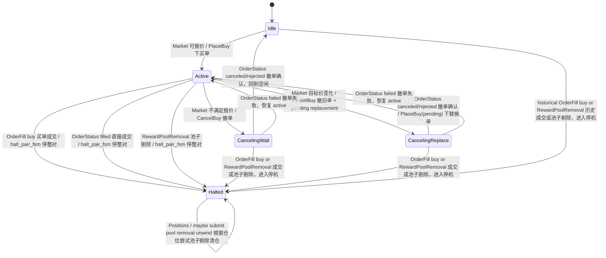
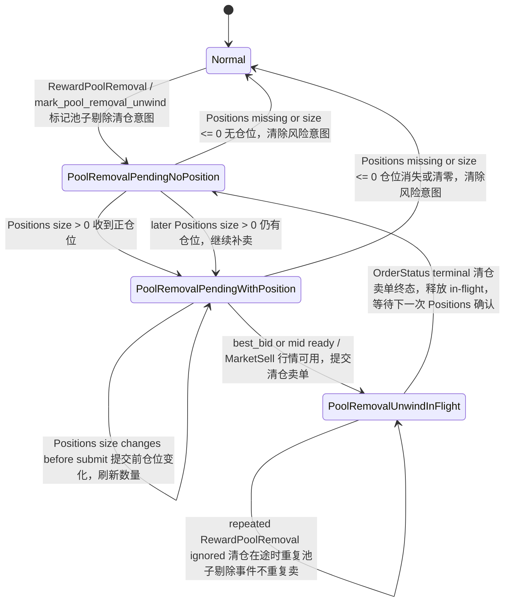
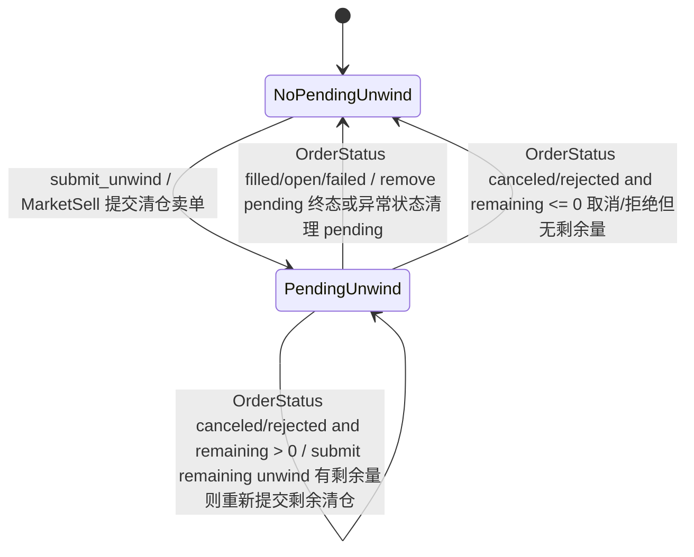
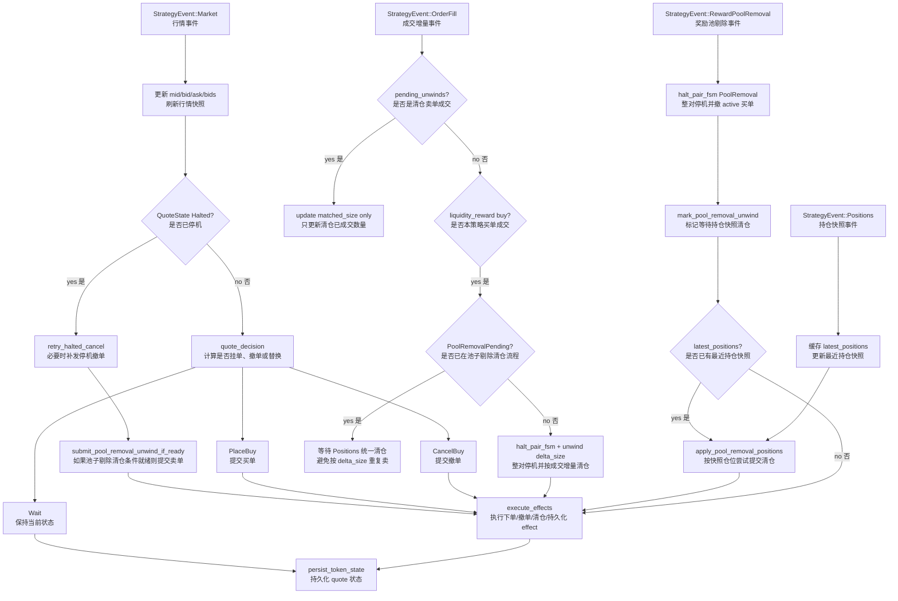

# Liquidity Reward FSM Mermaid

本文档记录 `src/strategies/liquidity_reward_fsm.rs` 当前状态机流转。后续修改 FSM 逻辑时需要同步更新本文档。

## Quote 状态机

状态含义：

- `Idle`：空闲，没有当前买单，等待下一次可报价行情。
- `Active`：已有一张做市买单在交易所。
- `CancelingWait`：正在撤当前买单，撤完后回到空闲，不补新单。
- `CancelingReplace`：正在撤当前买单，撤完后提交 pending replacement 新买单。
- `Halted`：风控停机状态，不再恢复报价，只处理撤单重试和清仓收尾。

## Risk 状态机

状态含义：

- `Normal`：正常风险状态，没有池子剔除清仓意图。
- `PoolRemovalPendingNoPosition`：已收到池子剔除事件，但还没有可用正仓位。
- `PoolRemovalPendingWithPosition`：已确认有正仓位，需要等行情价格可用后提交清仓卖单。
- `PoolRemovalUnwindInFlight`：池子剔除清仓卖单在途，避免重复剔除事件导致重复卖出；卖单终态后回到 pending，等待下一次 Positions 确认是否仍有仓位。

## Unwind 卖单状态机

状态含义：

- `NoPendingUnwind`：当前没有在途清仓卖单。
- `PendingUnwind`：已有一张清仓卖单提交到 executor，等待成交、取消或失败状态。

## 事件流

节点含义：

- `StrategyEvent::Market`：公开行情事件，驱动正常报价、停机撤单重试、池子剔除延迟清仓。
- `StrategyEvent::OrderFill`：订单成交增量事件，买单成交会触发整对停机，unwind 卖单成交只更新已卖数量。
- `StrategyEvent::RewardPoolRemoval`：奖励池剔除事件，触发整对停机并标记等待 positions 清仓。
- `StrategyEvent::Positions`：持仓快照事件，用于池子剔除后确认实际仓位并提交清仓卖单。
- `execute_effects`：把 FSM 产生的 effect 转成 `OrderSignal` 或 DB 写入。
- `persist_token_state`：把当前 quote FSM 投影写入 orders.db，供重启恢复。

